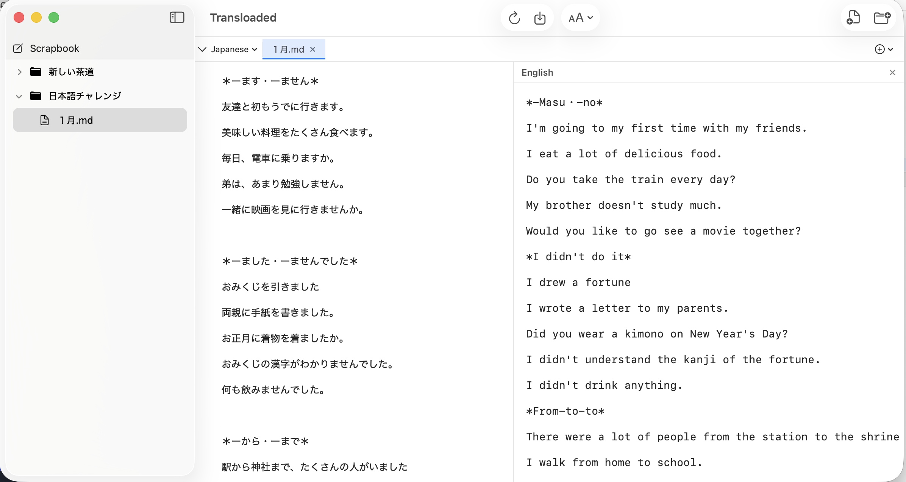

# Transloaded

A native macOS file translation app powered by Apple's on-device Translation framework. Open files and directories, auto-detect languages, and translate content side-by-side — all offline, all private.

  




## What It Does

Transloaded lets you open text-based files and instantly translate them into any of 20 supported languages. Translations appear in side-by-side panels next to the original content. Everything runs locally on your Mac using Apple's Translation framework — no cloud services, no API keys, no data leaving your machine.

## Features

- **File & directory browser** — Open individual files or entire directory trees. Navigate with a sidebar inspired by Sublime Text and Obsidian.
- **Side-by-side translation panels** — Add one or more translation panels per file. Each panel translates the source into a different language.
- **Auto language detection** — Source language is detected automatically using NaturalLanguage. Override it manually if needed.
- **20 languages** — Arabic, Chinese (Simplified & Traditional), Dutch, English, French, German, Hindi, Indonesian, Italian, Japanese, Korean, Polish, Portuguese, Russian, Spanish, Thai, Turkish, Ukrainian, Vietnamese.
- **Scrapbook** — A quick-entry text pad for pasting or typing content to translate on the fly. Language detection triggers automatically after you stop typing.
- **File watching** — If an open file is modified externally, a banner offers to reload the file and retranslate.
- **Recent files & folders** — Quickly reopen previously used files and directories from the File menu.
- **Default translation language** — Optionally set a target language in Settings so translation panels open automatically when a file is loaded.
- **Save translations** — Export translated content with a configurable naming pattern (e.g., `readme_fr.md`).
- **Language pack management** — Downloads required language packs on demand. Supports two-hop translation through English for unsupported direct pairs.
- **Sandboxed** — Runs in the macOS app sandbox with user-selected file access and security-scoped bookmarks for recent items.

## Requirements

- macOS 15 (Sequoia) or later
- Xcode 16+ with Swift 6
- [XcodeGen](https://github.com/yonaskolb/XcodeGen) (for project generation)

## Building

```bash
# Generate the Xcode project
xcodegen generate

# Build from command line
xcodebuild -project Transloaded.xcodeproj -scheme Transloaded -configuration Debug build

# Or open in Xcode
open Transloaded.xcodeproj
```

> **Note:** XcodeGen may strip the entitlements file reference. If you get sandbox errors at runtime, verify that `Transloaded/Transloaded.entitlements` is set under the target's **Signing & Capabilities** in Xcode.

## Project Structure

```
Transloaded/
├── TransloadedApp.swift          # App entry point, menus, keyboard shortcuts
├── Models/
│   ├── SupportedLanguage.swift   # 20-language enum with locale mappings
│   ├── OpenFile.swift            # Open file model (includes scrapbook)
│   ├── FileItem.swift            # Sidebar file tree node
│   ├── TranslationPanel.swift    # Translation panel state
│   └── TranslationError.swift
├── ViewModels/
│   ├── AppState.swift            # Core app state — files, translations, scrapbook
│   ├── SettingsState.swift       # Persisted user preferences
│   ├── SidebarViewModel.swift    # Sidebar file tree management
│   └── TranslationViewModel.swift# Language pack downloads
├── Views/
│   ├── ContentView.swift         # Main layout — sidebar + editor
│   ├── Sidebar/
│   │   └── SidebarView.swift     # File tree with scrapbook button
│   ├── Editor/
│   │   ├── EditorAreaView.swift  # Tab bar + source + translation panels
│   │   ├── FileTabBar.swift      # Open file tabs
│   │   └── FileContentView.swift # Source content (read-only / scrapbook editor)
│   ├── Translation/
│   │   └── TranslationPanelView.swift
│   └── Settings/
│       └── SettingsView.swift    # Language toggles, defaults, save pattern
└── Services/
    ├── TranslationService.swift  # Translation session management + two-hop
    ├── FileSystemService.swift   # File reading
    ├── FileWatcherService.swift  # DispatchSource file monitoring
    └── RecentItemsManager.swift  # Recent items with security-scoped bookmarks
```

## How Translation Works

Transloaded uses Apple's `Translation` framework (macOS 15+), which runs entirely on-device:

1. Language packs are downloaded once per language pair (~50-200 MB each).
2. Translation sessions are cached and reused for performance.
3. If a direct language pair isn't available, Transloaded automatically routes through English as an intermediate (two-hop translation).

No internet connection is required after language packs are downloaded.

## Settings

Open **Transloaded > Settings** (Cmd+,) to configure:

| Setting | Description |
|---------|-------------|
| **Active Languages** | Toggle which of the 20 languages appear in menus |
| **Default Source Language** | Fallback when auto-detection can't determine the language |
| **Default Translation Language** | Auto-open a translation panel for this language on file open |
| **Save Naming Pattern** | Template for exported filenames — tokens: `{name}`, `{lang}`, `{ext}` |

## Keyboard Shortcuts

| Action | Shortcut |
|--------|----------|
| Open File | Cmd+O |
| Open Directory | Cmd+Shift+O |
| Save Translation | Cmd+S |
| Close Tab | Cmd+W |
| Reload File | Cmd+R |
